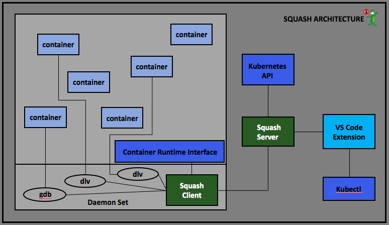

# Technical Overview

## Squash Key concepts:

**Squash server** holds the information about the breakpoints for each application, orchestrates and controls the squash clients. Squash server deploys and runs on Kubernetes

**Squash client** deploys as daemon set on Kubernetes node. The client wraps as docker container, and also contains the binary of the debuggers.

**Squash User Interface:** squash uses IDEs as its user interface. After installing the Squash extension, Squash commands are available in the IDE command palette. 

## Squash set of commands: 

#### *-	debug container*

**Extension:** When a user chooses this option, the extension communicates with kubectl and presents the user with the running pods. Once the user chooses a pod, the extension presents the containers currently running in the pod. When the user chooses a container, the extension makes a call to Squash server with the information of what to debug and waits for Squash server to supply the port for connecting to the debugger server. Finally, the extension connects to the debug server and transfers control to the native debug extension.

**Squash server:** When the extension makes an api call to squash server, the server connects to the relevant squash client and sends the information of the pod and container that should be attached to a debugger, and the set of breakpoints. The server then waits for the reply that tells it which port to connect.

**Squash client:** Upon getting a request from the server, the client communicates with CRI to obtain the container host pid, allowing the debugger to attach. The client then runs the debugger, attaches it to the process in the container, and sets the application breakpoints. Squash client return the debug server address to Squash server to allow the VS Code debugger client to connect directly to the native debug server. 

#### *-	debug service*

**Extension:** When a user chooses this option, the extension communicates with kubectl and presents the user with the existing services. Once the user chooses a service, the extension presents the current images used in that service. 
When the user chooses the image, the extension makes a call to Squash server with the information of what to debug, and waits on Squash server to supply the port to connect to the debugger server. The extension then connects the debug server and transfers control to the native debug extension.

**Squash server:** When the extension makes an api call to squash server, the server starts to watch the service for the creation of a new container. When a container with the specified image is created, the server notifies the relevant squash client with the pod and container that should be attached to the debugger, and with the set of breakpoints. The server then waits for a reply that tells it which port to connect. The server sends the first reply back to the extension. The server only allows a single active session at a time, and returns an error to clients trying to add more sessions.

**Squash client:** Upon getting a request from the server, the client communicates with CRI to convert container to host pid, allowing the debugger to attach. The client then runs the debugger, attaches it to the process (container), and sets the application breakpoints. 

When a debug event happens (either a breakpoint hit or program crash) the Squash client that manages the container where the event happened returns the debug server address to Squash server, allowing the VS Code debugger to connect. Squash also instruct the others squash clients, that manage other containers in the service, to detach the debuggers.

#### *-	resume debug session*
Resumes the session between the squash server and the IDE. This command should be used whenever the user that initiated a debug service command had lost the session with Squash server (by closing the IDE or for any other reason), and is interested in resuming the session. An indication that the session had been resumed can be found in the status bar: “⏱ Waiting for Debug Session” 

#### *-	release debug session*
Release the session with the squash server to the IDE. This command is used when the user who initiated a debug service command no longer wants to wait for debug session. This command does not detach the debugger from the process, but releases the session with the squash server. This command can be called from command palette, or simply by clicking the “⏱ Waiting for Debug Session” indication in the status bar. 

#### *-	stop debug service*
The IDE extension instructs Squash server to stop debugging the service and release the session.

#### *-	Toggle service breakpointg*
When debugging a service with Squash, user can set Squash breakpoints []  from the command palette in the IDE. 
After initiating the debug service command, Squash client attaches the debugger to all the containers (created by the requested image) in the service, and waits for a debug event to happen. A debug event is either an unmanagement exception or a Squash breakpoint being hit. The Squash client then returns the debug server address to Squash server, and instructs the others squash clients that manage other containers in the service to detach the debuggers. Once the port returns to Squash server and the debugger client connects to the debugger server the IDE breakpoint become active.

## Constraints
- In order to debug a program, you need to have a debugger on the same node, with the process to be debugged visible to it.
- Internal structure of the program can change every time a program is compiled.

## Solution

Given there constraints, we need to run a squash client on every node in the cluster. The Squash client shares the hosts PID namespace (and hence can see all processes on the node, making them available to be debugged). 

When a specific pod needs to be debugged, the user notifies the squash server about it. the squash server then notifies
the squash client on the specific node the pod runs on via long poll notifications.

When the squash client receives a notification, it just contains information on which pod and container should be debugged.
The next step is to figure out which pid we want to debug. To do that, the squash client obains a list of all the 
currently running pids in that container using the CRI API. It does so in a CRI agnostic way, with the only assumption that "ls" is present inside the image.

The list of pids is in the squash container's namespace, which is exactly what we need. Squash takes the process that was created first, and attaches a debugger to it, in debug server mode.

Once the debug server is attached, squash retreives the port it is listening on, and notfies the server on the address of the
debug server. Squash server then makes this information available to the user. The user can then use his regular debugger
to do remote debugging. If there network issues, they can be worked around using `kubectl port-forward`

